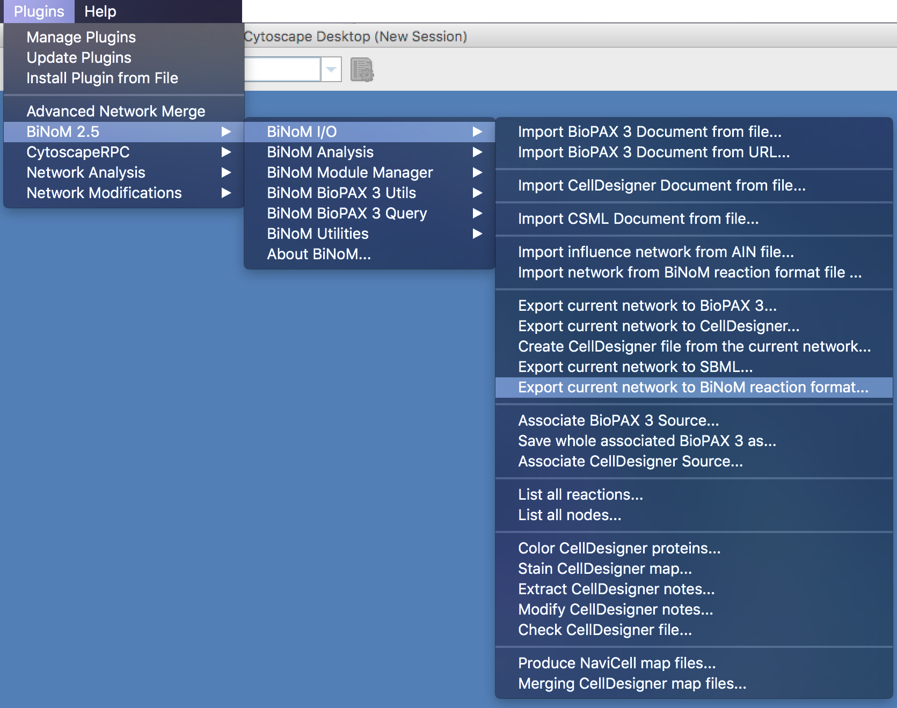
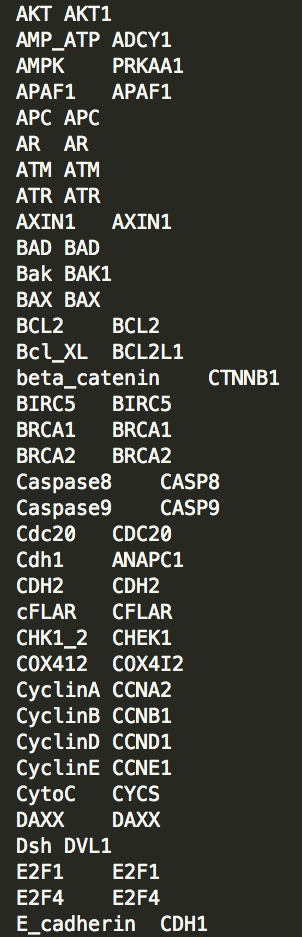

# Tutorial to convert a Cytoscape network into a Navicell map

By Nicolas Sompairac, U900, Institut Curie

1. Create a working folder containing BiNoM_all.jar and NaviCell Factory ([https://github.com/sysbio-curie/NaviCell](https://github.com/sysbio-curie/NaviCell)).

2. Create a folder in "*NaviCell-master/factory/maps*" called "*name_src*"

3. From Cytoscape (2.8) export "*.brf*" file of the network using the BiNoM plugin and export network view as "name_master.png" (`Plugins -> BiNoM 2.5 -> BiNoM I/O -> Export current network to BiNoM reaction format`):

   One can export network to "*.xgmml*" format in new version of Cytoscape, open it in Cytoscape 2.8 and export to “*.brf*” with BiNoM

4. Create smaller ".PNGs" for zoom-outs by using any image manipulation application or with the command:

   `sips -Z 320 name_master-n.png --out name_master-(n-1).png` (320 is width of new image, it should always be halved from the original. The largest image is the one with the biggest "n" and the smallest has to be “*name_master-0.png*”)

5. Create "*.xml*" file by taking coordinates of topleft (x1,y1) and bottomright (x2,y2) nodes (from image with maximum size, this will be the maximum zoom), and run

   `java -jar */BiNoM_all.jar fr.curie.BiNoM.pathways.BiNoMReactionFormatToCytoscapeConverter -brf */name.brf -points 'topleftnode(x1,y1):bottomrightnode(x2,y2)'`

6. Using NaviCell, it is possible to add links for species to specific databases such as Gene Cards or Gene Names. To do this, you have to generate a table containing two columns: The first column containing names of nodes in the network and the second column containing the correct ID of the wanted database. You can then integrate these IDs in the map file by using the python script  "Modify_annotations.py" (a help is provided by launching python Modify_annotations.py --help). An example of the usage of this this script is:

   `python Modify_annotations.py --corresp IDtable_file.txt --origin-file name.xml --result-file name.xml --link-type HUGO`

7. Rename "*name.xml*" and "*name-n.png*" files to "*name_master.xml*" and "*name_master-n.png*" and move them to the folder "*NaviCell-master/factory/maps/name_src*"

8. Create a "*config*" file in “*NaviCell-master/factory/maps/name_src*” folder with the following 4 lines:

   base: name_

   title: name

   name: name

   showDefaultCompartmentName: true

9. Make "*config*" file executable with the command line:

   `chmod +x NaviCell-master/factory/maps/name_src/config`

10. Specify "*build_name.sh*" file, by changing "configdir" and "destdir"

11. Generate the NaviCell file by running:

   `sh build_name.sh`

12. Close your Chrome session and then open in Chrome with: 

   `open -a "Google Chrome" --args --allow-file-access-from-files 'file:///*/*NaviCell-master*/site/docroot/navicell/maps/*/master/index.html'`

   where * is the name of your folder

13. If Markers are not on top of corresponding entities, the ".PNGs" have to be adapted to the correct resolution (**_By Hand_**). This procedure can be eased by taking as reference the image of the map obtained from CellDesigner.

14. If the map is not visible, be sure that you have opened Chrome with the previous command. If the problem persists, you may use the following command line to repair the Google Maps API conflict:

   `find NaviCell-master/site/docroot/navicell/maps/**_map_name_**/master/ -name "index*" -exec sed -i 's/js?sensor=false/js?sensor=false\&v=3.30/g' {} +`

